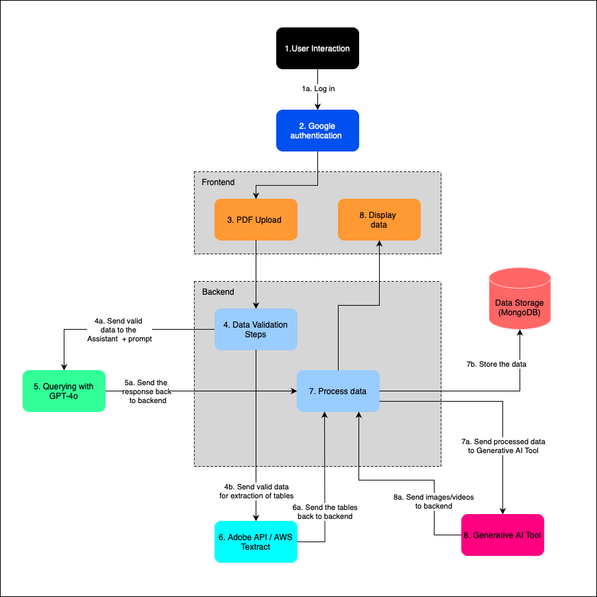

# School of Computing &mdash; Year 4 Project Proposal

## SECTION A

|                     |                         |
|---------------------|-------------------------|
|Project Title:       | TimelineXtract          |
|Student 1 Name:      | Lorena Gomez            |
|Student 1 ID:        | 21734359                |
|Student 2 Name:      | Darragh Manning         |
|Student 2 ID:        | 21506373                |
|Project Supervisor:  | Tomas Ward              |

## SECTION B

### Introduction

Getting a pharmaceutical to market is very expensive and time consuming. Part of this is understanding a CTP, a large document a vendor must refer to. Speeding up the clinical trial process can reduce costs and save lives, allowing new treatments to reach patients more quickly.

This project is a web application leveraging machine learning techniques to optimize the clinical trial process.

### Outline

The app has two main features.

1. Timeline Extraction: Uses NLP to extract PROs and ClinROs from CTPs, and presentes the info visually
2. Image Generation: Generates instructional videos or images, from textual desciptions of patient procedures.

Additionally we may add a feature where the user can interact with an LLM and ask questions about their timeline.

### Background

The idea for this project came from Lorena's experience in the field and first hand experience with the challenges encountered in clinical trials. We believe we can help both patients and the pharma companies with this project.

### Achievements

**The project will deliver:**

- **Automatic Timeline Extraction:**
- **Generative AI Media for Patients:**

**Target Users:**

- **Vendors:** Companies managing clinical trials,
- **Patients:** Participants in clinical trials.

### Justification

**The project is essential because:**

- **Speeding Up Trials:** Clinical trial protocols are lengthy and expensive, and manually extracting schedules is inefficient. Automating this process saves time and resources.

- **Improving Patient Compliance:** Patients often struggle to follow complex clinical procedures at home. Clear, AI-generated visual instructions can help reduce errors.

- **Getting treatment to market:** The longer these trials take the longer critically sick individuals are unable to access medicine that could be life-saving.

**Use Cases:**

- **Vendors**: Automate and shorten the process of making a timeline from a CTP
- **Patients**: Get visual instuctions on the procedures they must perform in the CTP

### Programming language(s)

- **Python:** Backend processing, NLP, and AI model integration.
- **JavaScript (React JS):** Frontend development for the web interface.

### Programming tools / Tech stack

- **Backend:** Django framework
- **Frontend:** React JS 
- **Database:** MongoDB will be used for storing protocol documents, patient data, and generated timelines.
- **Machine Learning:** OpenAI models for generative AI and Adobe API for PDF extraction.
- **Other Tools:** Some visual tool to display the extracted timeline data.

### Hardware

Any device with browser access.

### Learning Challenges

This project involves several technologies that require learning:

1. **Natural Language Processing (NLP):** Applying NLP for timeline extraction from clinical protocols.
2. **Generative AI Models:** Learn how to use text-to-image and image-to-text tools.
3. **Adobe API Integration:** Understand how to use this tool to parse clinical trial protocols.
4. **React JS:** Building a complex frontend application in React may present learning challenges.
5. **Clinical Trial Knowledge:** Gaining an understanding of how clinical trials are structured,.

### Breakdown of work

#### Lorena's Responsibilities

- Backend Development: Focus on the implementation of the machine learning models for the NLP timeline extraction.
- Integration of NLP Tools: Handle the integration of the NLP pipeline for extracting PRO and ClinRO timelines from protocols.
- Database Setup: Design and manage the MongoDB database for storing protocols and timelines.
- API Integration: Handle the integration with external services such as OpenAI’s generative models and Adobe’s PDF extraction service.

#### Darragh's responsibilty

- Frontend Development: Use UI/UX principles to give the web app a sleek look.
- Image generation: Develop Text-to-Image feature.
- Documentation: Keep us ahead of the deadlines.
- Expo Preperation: Plan the stall for the expo and consider what need to be done for it.

## System Architecture Diagram

  

